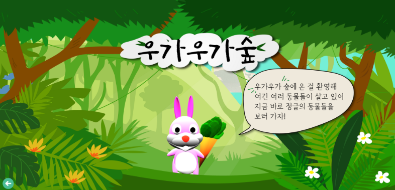

# 🎪 상상놀이터(소아병동 아이들을 위한 IoT 서비스)

<!-- 필수 항목 -->

</br>

## ✔ 카테고리

| Application | Domain | Language | Framework |
| ---- | ---- | ---- | ---- |
| :white_check_mark: Desktop Web | :black_square_button: AI | :white_check_mark: JavaScript | :black_square_button: Vue.js |
| :black_square_button: Mobile Web | :black_square_button: Big Data | :black_square_button: TypeScript | :white_check_mark: React |
| :white_check_mark: Responsive Web | :black_square_button: Blockchain | :black_square_button: C/C++ | :black_square_button: Angular |
| :black_square_button: Android App | :white_check_mark: IoT | :black_square_button: C# | :black_square_button: Node.js |
| :black_square_button: iOS App | :black_square_button: AR/VR/Metaverse | :black_square_button: ​Python | :black_square_button: Flask/Django |
| :black_square_button: Desktop App | :black_square_button: Game | :white_check_mark: Java | :white_check_mark: Spring/Springboot |
| | | :black_square_button: Kotlin | |

<!-- 필수 항목 -->

## 💁‍♀️ 프로젝트 소개

- **개요**
  - 소아병동 아이들을 위한 교육 및 놀이 통합형 IoT 서비스
  - 실시간 참여할 수 있는 IT 놀이공간

* **주요 기능**

  * 4개의 테마(정글, 우주, 바다, 크리스마스)로 다양한 체험 제공
  * 아이들의 정서적 및 신체적 발달을 위한 간단한 놀이 제공
  * 회원 담당 환자등록 서비스
  * 회원관리 및 1대1 문의 서비스
  * 빔 프로젝터, 키오스크 등 확장 가능한 IoT & 웹 서비스

* **주요 기술**

  - Single Page Application
  - Raspberry Pi
  - REST API

* **프로젝트 기간**

  2022.07.11 ~ 2022.08.19

* **배포 환경**

  - URL: https://i7d204.p.ssafy.io/

</br>

## 👨‍👧‍👧 요들(요셉과 아이들)팀 소개
<table>
    <tr>
        <td height="140px" align="center">
             <br><br> 양요셉 <br>(Back-End) </a> <br></td>
        <td height="140px" align="center"> 
             <br><br> 김성령 <br>(Back-End) </a> <br></td> 
        <td height="140px" align="center">
             <br><br> 권성호 <br>(Front-End) </a> <br></td>
        <td height="140px" align="center"> 
             <br><br> 박소정 <br>(Front-End) </a> <br></td>
        <td height="140px" align="center"> 
             <br><br> 유지홍 <br>(Front-End) </a> <br></td> 
        <td height="140px" align="center">
             <br><br> 임영선 <br>(IoT) </a> <br></td>
    </tr>
    <tr>
        <td align="center" width="140px"> 👑팀장 <br> 서버 API 개발 <br> DB 관리 <br> CI/CD 
        <td align="center" width="140px"> 서버 API 개발 <br> DB 관리 <br> CI/CD 
        <td align="center" width="140px"> 3D 캐릭터 제작 <br> 라즈베리파이와 프론트엔드 통신 담당
        <td align="center" width="140px"> 게임 작동방식 구현 <br> UI/UX 디자인 <br> Three.js <br> CSS 스타일링
        <td align="center" width="140px"> 웹 페이지 제작<br> 게임 작동방식 구현 <br> 라즈베리파이와 프론트엔드 통신 담당
        <td align="center" width="140px"> 초음파 센서를 이용한 터치기능 구현 <br> openCV, face_recognition을 이용한 얼굴인식 기능 구현
    </tr>
</table>

</br>

## 🎁 프로젝트 상세 설명

**어디서도 아이들의 상상력이 멈추지 않도록**✨

**상상놀이터**는 소아병동 아이들을 위한 교육 및 놀이 통합형 IoT 서비스입니다.

병원이라는 제한적인 공간에서 오랜 시간을 보내는 환우들에게 다양한 경험을 선물해주고 싶어 기획하게 되었습니다. 또한 힘든 치료와 장기입원으로 인해 또래들보다 신체적 및 정서적 발달이 늦은 아이들에게 놀이를 통해 도움을 주고자 하였습니다.

</br>

### 🎞️서비스 화면


- 메인 지도 화면
  - 각 캐릭터를 클릭(터치)하면 우주 게임 맵, 정글 게임 맵, 바다 게임 맵 및 이벤트성 크리스마스 마을 맵으로 이동 가능합니다.

</br>



- 게임 테마- 정글 <우가우가숲>
  - 동물의 울음소리를 듣고 이름을 외치면 동물의 모습이 나타나며 응원의 메시지를 함께 외치는 시간을 가집니다.
  - 음성 인식 기술을 활용하여 아이들의 음성을 파악합니다.

</br>


- 게임 테마 - 우주 <갤럭시월드>
  - 전반부 게임은 행성을 순서대로 클릭하여 잃어버린 색깔을 찾아주는 스토리입니다.
  - 후반부 게임은 상단의 지시에 맞게 순서대로 플라스틱/ 종이/ 병을 터치하여 분리수거의 개념을 익히는 스토리입니다.
  - 초음파 센서를 활용해 마우스 클릭이 아닌, 아이들의 손을 인식하여 터치를 인식합니다. 아이들이 손으로 터치하여 해당 이미지에 반응이 오면 게임이 진행되고 다음 스테이지로 넘어가게 됩니다.

</br>


- 게임 테마 - 바다 <언더더씨>
  - 초음파 IoT 센서를 활용한 터치 게임과 TeachableMachine 을 활용한 모션 인식 체조가 가능합니다.
  - 전반부는 움직이는 상어를 5회 터치하여 쫓아내고 바다를 지킨다는 스토리의 게임입니다.
  - 후반부는 간단한 율동 동작이 나와 아이들과 함께 체조를 하고, TeachableMachine을 통해 체조에 참여하는 아이들의 모습을 화면에 띄워주었습니다.

</br>


- 이벤트 테마 - 크리스마스 <눈 내리는 마을>
  - 얼굴 인식 기능을 탑재한 테마입니다.

</br>


### 🛠 기술 환경

```
프론트엔드: React, Three.JS(3D 웹 실행), Blender(3D 캐릭터 구현) Axios (API 통신 라이브러리), Mui(리액트 CSS 라이브러리), Javascript, Redux(리액트 상태관리 라이브러리), HTML5, CSS3

백엔드: Spring Security를 활용한 OAuth2.0과 JWT를 활용한 인증 방식 Naver Clova/Google Speech를 활용한 음성인식 기능 탑재 MariaDB

IoT: 라즈베리파이(Raspberry Pi 4 Model B Rev 1.2) Python(3.7.3) face_recognition(1.3.0)

기획: JIRA, Notion, Mattermost (팀 협업, 프로젝트 관리) GitLab(버전관리) Figma(디자인 협업) ERD cloud(DB 모델링) Coggle(마인드맵)
```

</br>

​             

### 📒 기술 스택

### Front

  


### Back

#### - Server


#### - DB


#### - Distribution


### IoT

#### - language


#### - equipment

* HC-SR04(초음파 센서), SIG H703(웹캠)

#### - library


